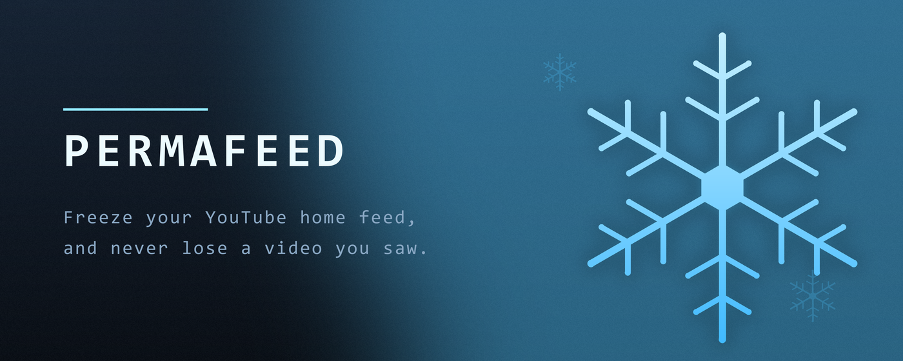
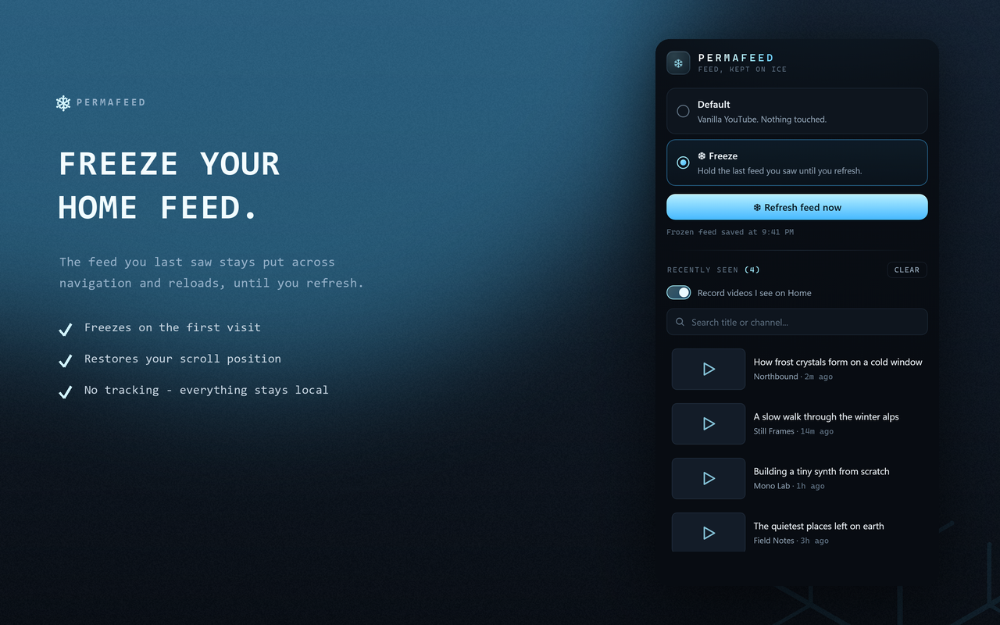
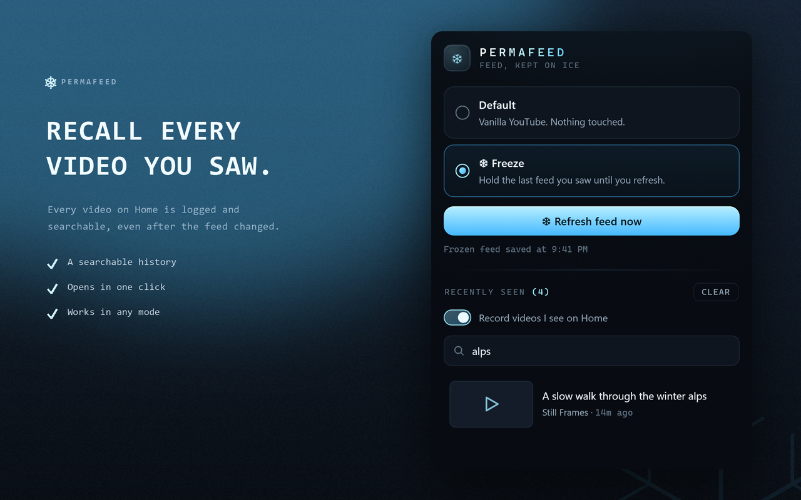
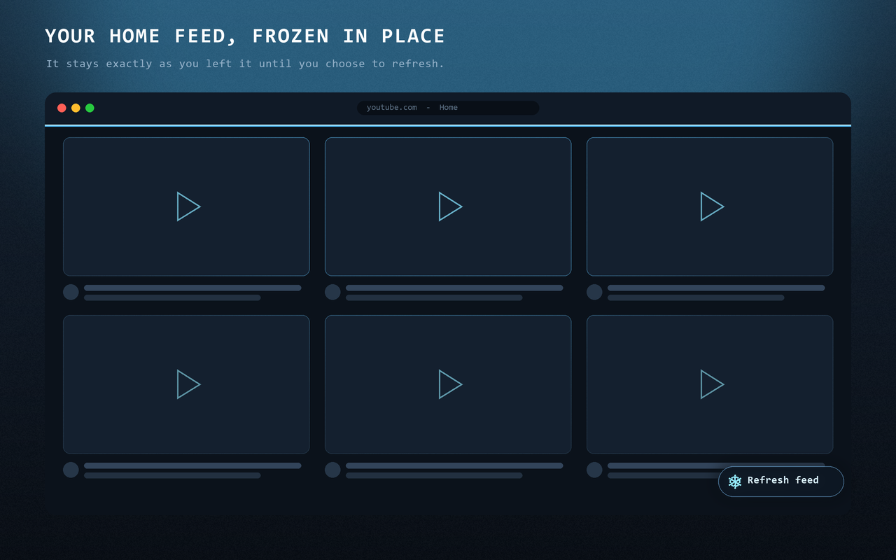

<div align="center">



### Keep your YouTube home feed exactly where you left it.

[](LICENSE)
[](manifest.json)
[](CONTRIBUTING.md)

</div>

---

YouTube rebuilds your home feed on every navigation. You spot an interesting video,
click away without opening it, come back, and it is gone, with no setting to prevent it.

**Permafeed** freezes the feed you last saw and keeps it there, across navigation and full
page reloads, until you decide to refresh. It also keeps a searchable log of every video
that has passed through your Home feed, so nothing you saw is ever truly lost.

A Manifest V3 extension for Chrome, Edge, and other Chromium browsers.

> **Status:** early but working. Freeze and the recently-seen log are functional.

## Features

- **Freeze mode.** The home feed you last saw is preserved across in-app navigation and
  full page reloads. It only changes when you ask. It freezes on the first visit (no need
  to click into a video first) and holds even when YouTube tries to re-render.
- **Recently-seen log.** Every video that appears on your Home feed is recorded
  (thumbnail, title, channel, link, time) into a searchable list in the popup, deduped by
  video id. Even if the feed changed, you can find "that video I saw 10 minutes ago." It
  works in any mode and can be turned off.
- **Default mode.** A kill switch: vanilla YouTube, nothing touched.
- **Manual refresh.** A floating button (and a popup button) clears the frozen feed and
  loads fresh videos on your terms.
- **Scroll position preserved.** You return exactly where you left off.
- **Private by design.** No tracking, no analytics, no backend. Everything is stored
  locally in your browser; the only network requests are video thumbnails, loaded from
  YouTube's own image CDN.

## Screenshots

<div align="center">







</div>

## Install (from source)

Permafeed is not on the Chrome Web Store yet. To run it now:

1. Clone the repo:
   ```sh
   git clone git@github.com:choshingcheung/permafeed.git
   ```
2. Open `chrome://extensions` (or `edge://extensions`).
3. Enable **Developer mode** (top-right).
4. Click **Load unpacked** and select the cloned folder.
5. Open [youtube.com](https://www.youtube.com), click the Permafeed icon, and choose
   **Freeze**.

## Usage

Open the popup from the toolbar and pick a mode:

| Mode | Behavior |
|------|----------|
| **Default** | Does nothing. Normal YouTube. |
| **❄ Freeze** | Keeps the last home feed you saw until you refresh. |

In Freeze mode, a floating **❄ Refresh feed** button appears on the home page. Click it
(or the button in the popup) whenever you want fresh videos. The popup also holds the
**Recently seen** list with search, and a toggle to turn logging on or off.

## How it works

**Freeze.** YouTube virtualizes the feed (off-screen tiles are empty placeholders), so the
content script captures only the tiles you actually scrolled past, pinning each thumbnail
(persisting the loaded URL, or deriving one from the video id) and dropping the
placeholders. The snapshot lives in `chrome.storage.local`. On returning or reloading it
waits for YouTube's render to settle, swaps the snapshot back in, then a `MutationObserver`
guard re-applies it if YouTube re-renders over the top.

**Recently-seen log.** As videos scroll through Home, the script scrapes each tile's id,
title, channel, thumbnail, and link into a list in `chrome.storage.local`, deduped by id
with first/last-seen timestamps. The popup renders it with search.

Every YouTube DOM selector is centralized in
[`src/content/selectors.js`](src/content/selectors.js). YouTube changes its markup often,
so a break is a one-line fix.

## Project structure

```
manifest.json                  MV3 manifest
src/
├── content/
│   ├── selectors.js           all YouTube selectors + config (single source of truth)
│   └── content.js             freeze (capture / restore / guard) + recently-seen log
├── background/
│   └── service-worker.js      settings defaults
└── popup/
    ├── popup.html             mode switch + recently-seen list UI
    └── popup.js
```

## Development

See [CONTRIBUTING.md](CONTRIBUTING.md) for the full guide. Quick version: load the folder
unpacked (above), edit, then hit the reload icon on the extension card. Set `debug: true`
in [`src/content/selectors.js`](src/content/selectors.js) to enable verbose `[Permafeed]`
console logging.

## Privacy

Permafeed keeps everything local to your browser. No accounts, tracking, analytics,
or servers; the only network requests are video thumbnails from YouTube's image CDN.
See [PRIVACY.md](PRIVACY.md) for the full policy.

## Contributing

Contributions are welcome. Please read [CONTRIBUTING.md](CONTRIBUTING.md) and our
[Code of Conduct](CODE_OF_CONDUCT.md). To report a security issue, see
[SECURITY.md](SECURITY.md).

## License

[MIT](LICENSE) © Permafeed contributors

---

<div align="center">
<sub>Not affiliated with, endorsed by, or sponsored by YouTube or Google.
"YouTube" is a trademark of Google LLC.</sub>
</div>
